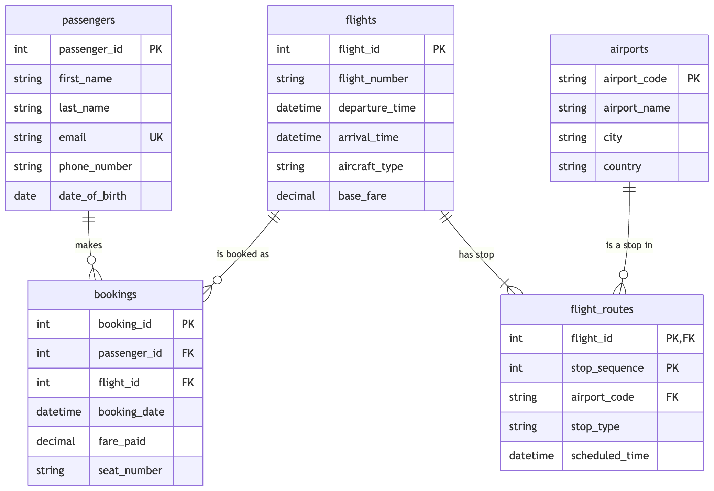

# Airline Booking Database

A PostgreSQL database that models an airline's booking system — passengers, flights, bookings, airports, and the routes connecting them.

## Project Overview

This repository contains my EX 603 course project: a PostgreSQL relational database for an airline booking system that organizes passengers, flights, bookings, airports, and flight routes.

The project will be developed incrementally across Units 1–6. It will begin with a relational data model and schema, then expand to include SQL queries, multi-table joins, data analysis, written reflections, and a final video presentation.

## Chosen Theme

I selected the **Airline Booking** theme. The database will model the following five roles required by the project:

| Database role | Table           | Purpose                                                       |
| -------------- | --------------- | -------------------------------------------------------------- |
| Actor          | `passengers`    | Stores information about passengers who make bookings.         |
| Producer       | `flights`       | Stores the flights available for passengers to book.           |
| Event          | `bookings`      | Records each booking, including its date and the fare paid.    |
| Catalog        | `airports`      | Stores descriptive information about airports.                 |
| Junction       | `flight_routes` | Connects flights and airports in a many-to-many relationship.  |

The main numeric metric for the project is `fare_paid`. As the project develops, the database will support questions such as which flights receive the most bookings, how much revenue flights generate, which passengers book most frequently, and which airports are associated with particular routes.

## Domain

The Airline Booking database models the core operations of an airline's booking platform: passengers, the flights they can book, the bookings themselves, the airports those flights touch, and the routes connecting flights to airports. It's designed to reflect how a real airline reservation system behaves — flights can include layovers across multiple airports, passengers accumulate a history of bookings over time, and every booking carries a fare that contributes to the platform's revenue.

The database needs to answer a consistent set of business questions as the project develops: which flights receive the most bookings, how much revenue each flight generates, which passengers book most frequently, and which airports are associated with which routes. These questions shaped several of the schema's design decisions — for example, routing every flight-to-airport relationship through a dedicated `flight_routes` table, rather than storing departure and arrival airports directly on `flights`, makes it possible to model flights with more than one stop and to answer airport-level questions without a separate structure for layovers.

The full entity-relationship diagram below shows how the five relations connect.



## Project Status

This project has completed **Unit 1: modeling and planning**. The five relation schemas, the entity-relationship diagram, the integrity constraints, and the Unit 1 written analysis have all been completed and are linked in the repository structure below. The SQL implementation, queries, and further analysis will be added in later units.

## Planned Repository Structure

```
.
├── README.md
├── schema/
│   ├── schema-definition.md
│   ├── constraints.md
│   ├── erd.png
│   └── erd.mmd
├── queries/
│   ├── unit3/
│   ├── unit4/
│   ├── unit5/
│   └── unit6/
├── analysis/
│   └── unit1.md
└── screenshots/
```

## Technology

- PostgreSQL 14 or later
- A PostgreSQL client DataGrip, or `psql`
- Git and GitHub for version control and project presentation

## How to Run the Project

The database setup instructions will be added after the schema is created in a later unit. Before running future SQL files, users will need PostgreSQL 14 or later and access to a PostgreSQL database.

## Query Catalogue

Queries and the business questions they answer will be documented here as they are completed.

| Unit   | Query or topic | Business question | Status      |
| ------ | --------------- | ------------------ | ------------ |
| Unit 3 | To be added     | To be added         | Not started |
| Unit 4 | To be added     | To be added         | Not started |
| Unit 5 | To be added     | To be added         | Not started |
| Unit 6 | To be added     | To be added         | Not started |

## Technical Highlights

Technical highlights will be added as the schema and queries are developed.

## What I Would Do Differently

This reflection will be completed near the end of the project after the database has been designed, implemented, and tested.

## Video Presentation

The final 8–12 minute video presentation will be linked here in Unit 6.

## Academic and Security Note

This repository is an academic project created for EX 603. It must not contain passwords, database connection strings, API keys, or personal data.
